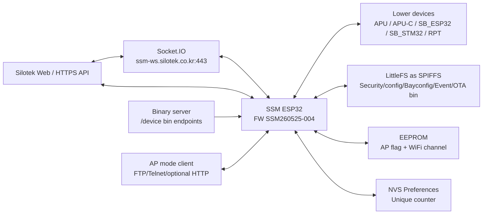

# SSM Source Topology

Source basis: https://github.com/stek747/ssm-esp32.git@178e29f7e94ab4ba2b1e1e2059e097bb377a2b98

Date: 2026-06-16
FW version: SSM260525-004

## Scope

This topology is source-derived. It maps SSM260525-004 communication peers, local stores, control surfaces, and lower-device paths without using live hardware or serial observation.

## System View

## Nodes

| Node | Role | Source anchors |
|---|---|---|
| SSM ESP32 | Central gateway/parser/controller. Firmware string is `SSM260525-004`. | `SSM_esp32.h:4`; `SSM_esp32.ino:19741` through `SSM_esp32.ino:19745` |
| Web HTTPS API | Receives init, config, usage, fault, inspect, reflash, and saved-event uploads. | `notes-web-commands.md`; `notes-event-reliability.md`; `notes-ota-lifecycle.md` |
| Socket.IO | Receives Web command payloads, sends ACKs, forwards Web command body into SSM parser buffer. | `SSM_esp32.ino:15006` through `SSM_esp32.ino:15083`; `SSM_esp32.ino:20434` through `SSM_esp32.ino:20441` |
| Binary server | Supplies OTA binaries and accepts missing-event bulk uploads. | `SSM_esp32.h:96`; `SSM_esp32.h:2221` through `SSM_esp32.h:2222`; `SSM_esp32.ino:17269` through `SSM_esp32.ino:17623`; `SSM_esp32.ino:21424` through `SSM_esp32.ino:21438` |
| Lower devices | ESP-NOW peers: APU, APU-C, SB_ESP32, SB_STM32, RPT. | `SSM_esp32.h:1917`; `notes-espnow-protocol.md`; `notes-flows.md` equivalent is `atlas/flows.md` |
| LittleFS as SPIFFS | Local config/event/OTA file store. | `SSM_esp32.h:23` through `SSM_esp32.h:28`; `SSM_esp32.ino:19869` through `SSM_esp32.ino:19888`; `SSM_esp32.ino:18230` through `SSM_esp32.ino:18319` |
| EEPROM | One-shot AP-mode flag and saved WiFi channel. | `SSM_esp32.h:171` through `SSM_esp32.h:179`; `SSM_esp32.ino:19782` through `SSM_esp32.ino:19840` |
| NVS Preferences | Stores rolling `Unique` value for route/event packet IDs. | `SSM_esp32.h:88` through `SSM_esp32.h:93`; `SSM_esp32.ino:97` through `SSM_esp32.ino:110`; `SSM_esp32.ino:20523` through `SSM_esp32.ino:20534` |
| AP-mode local tools | SoftAP, FTP, Telnet, optional local HTTP server if compiled. | `SSM_esp32.ino:20053` through `SSM_esp32.ino:20169` |

## External Web Paths

| Direction | Transport | Primary payloads / endpoints | Source notes |
|---|---|---|---|
| Web -> SSM | Socket.IO `message` event | `operationType`, `reqId`, `WSRESET`, target MAC/device IDs, OTA command types | `notes-web-commands.md`; `notes-ota-lifecycle.md` |
| SSM -> Web | Socket.IO | command ACKs, usage/fault/inspect messages when connected | `SSM_esp32.ino:15036` through `SSM_esp32.ino:15068`; `SSM_esp32.ino:3693` through `SSM_esp32.ino:3703` |
| SSM -> Web | HTTPS POST | `/usage`, `/fault`, `/inspect`, `/init`, `/bayConfig`, `/unitPrice`, `/reflash/done`, saved-event replay | `notes-web-commands.md`; `notes-fault-codes.md`; `notes-event-reliability.md` |
| SSM -> Binary server | HTTPS POST/download | OTA binary download and missing-events upload | `notes-ota-lifecycle.md`; `notes-event-reliability.md` |

## ESP-NOW / Lower-Device Paths

| Flow | Direction | Primary keys | Notes |
|---|---|---|---|
| Registration / info | lower -> SSM and SSM -> lower | `Mac`, `UnID`, `INFO`, `RTC`, `ASK:"TIME"`, `CHANNEL` | Maintains `InfoListArr`, time sync, comm counters, route state. |
| Web command relay | SSM -> lower | `Mac` or `UnID`, command-specific keys, `Ssn` | Web `operationType` branches generate lower-device JSON commands. |
| Usage / event uplink | lower -> SSM -> Web | `bOrder`, `ResRfCtrl`, `uFault`, `rfCard`, `Coin`, `CtrlFunc`, `Unique`, `Cidx`, route header `R` | Duplicate suppression uses raw buffers, route cache, and `Unique` cache. |
| Route plan / fallback | SSM <-> lower | `CHPLAN`, `REQRSSI`, `REPRSSI`, route header `R` | Used for SB Event.txt uplink route selection and ACK replay. |
| Card charge | SSM -> lower -> SSM -> Web | `SET_CARD`, `Gubun:15`, `Gubun:17`, `CuID`, `tsKey`, `ResRfCtrl` | MAC-free charge uses SSM queue and reconnect catch-up. |
| OTA | Web -> SSM -> lower | `UP_INIT`, `UP_FORMAT`, `UP_READY`, `UP_SAVEAPIECE`, `UP_REFLASH`, `UP_CANCDOWN`, `ONLYYOU...` | SSM downloads binary to filesystem, sends prep/pieces/reflash to targets. |
| Communication health | SSM <-> lower -> Web | `INFO:"REQ"`, counters, `C0002` | Periodic and manual inspection use `cntReq/cntRev`, 35/65 hysteresis. |

## Local Control Surfaces

| Surface | Active in source? | Purpose |
|---|---:|---|
| Serial console | Yes | Runtime `serialCmd`, boot menu, file/time/config/OTA/test commands. |
| Telnet | Yes in AP mode | Remote command input over port 23. |
| FTP | Yes in AP mode | Local file access in AP mode. |
| Local HTTP update server | No, guarded by inactive `HTTPSERVER` | Present in source, not active in this snapshot. |
| MQTT | No, guarded by inactive `DEFMQTT` | Present in source, not active in this snapshot. |
| CAN | No, guarded by inactive `COM_CAN` | Present in source, not active in this snapshot. |
| WSCL reset GPIO | Yes | `WSRESET` body command pulses GPIO 12 low for 500 ms. |

## Reliability Boundaries

- If Web/HTTP delivery fails, SSM saves events to `/Event.txt`, may back up failed retries to `/bkEvent.txt`, and can bulk-upload missing events (`notes-event-reliability.md`).
- If lower-device routed events repeat, SSM can suppress duplicates and replay ACKs using route headers and raw packet buffers (`notes-event-reliability.md`; `notes-espnow-protocol.md`).
- If lower-device communication drops, SSM distinguishes stale/offline freshness from communication-fault ratio and reports `C0002` only through the confirmation path (`notes-comm-health.md`).
- If WiFi/Socket/HTTP flaps, SSM reports `C0003`, `C0004`, and `C0005` separately (`notes-time-network.md`; `notes-fault-codes.md`).
- If a MAC-free card charge completes on one device, SSM keeps a completed queue slot for 24 hours to push `Gubun:17` clear to devices that reconnect late (`notes-card-charge.md`).

## Source-Only Caveats

- This topology does not prove deployed runtime config, physical wiring, or lower-device firmware behavior.
- `COM_CAN`, `HTTPSERVER`, and `DEFMQTT` source blocks are documented as present but inactive because their defines are commented out in this snapshot.
- Local file names use `SPIFFS` symbols in code, but the active filesystem implementation is `LittleFS`.
